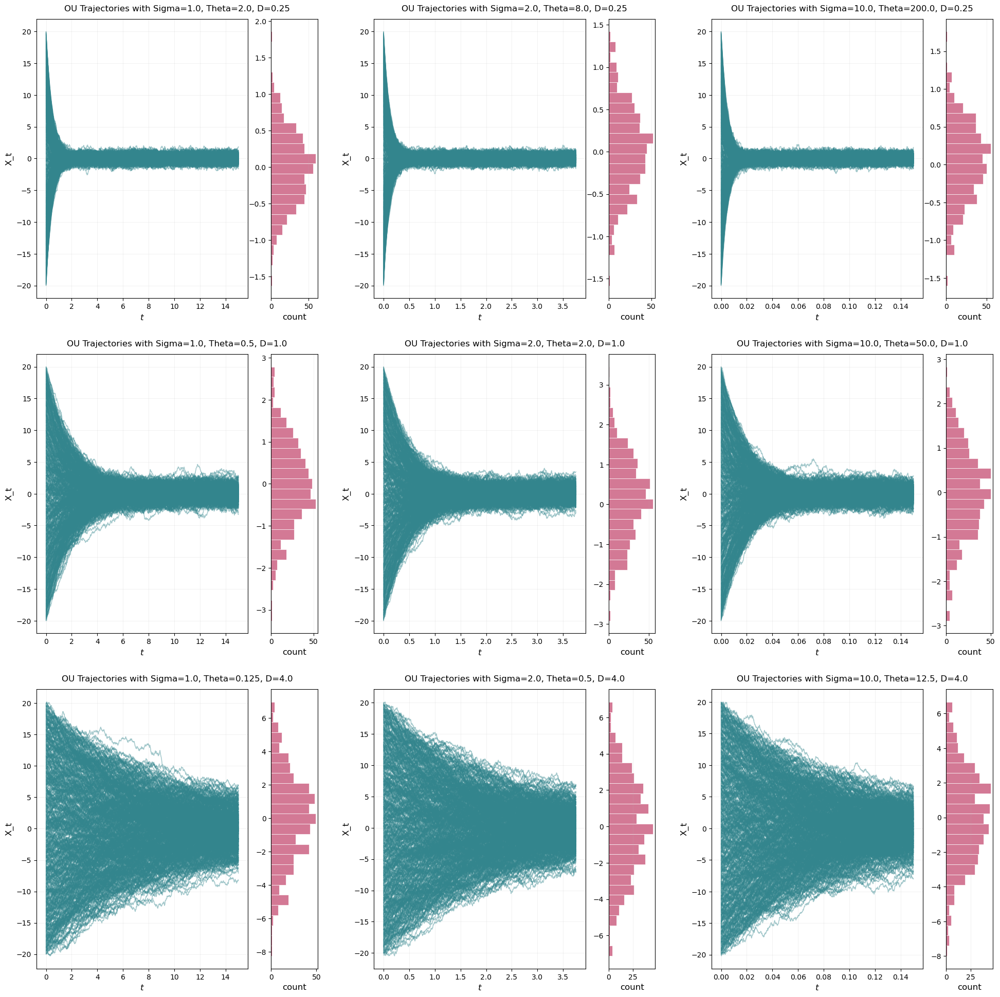
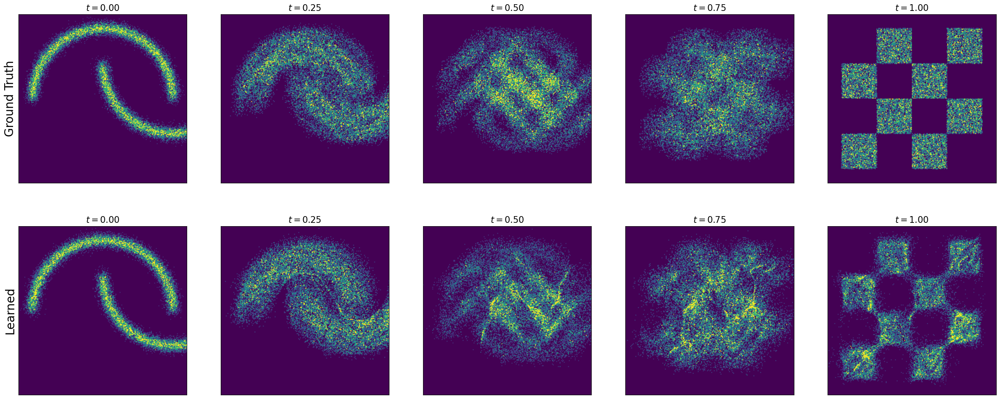
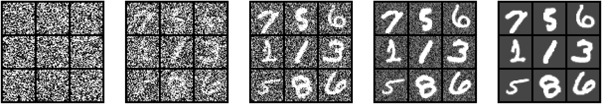
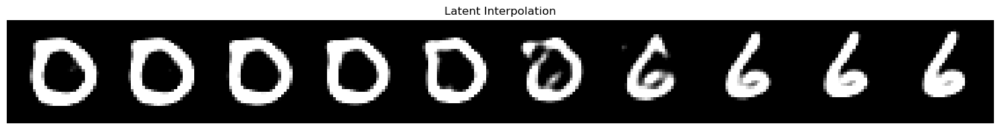

# FM Labs

My solutions to the three flow matching / diffusion labs from the *Foundation Models* course: simulating SDEs, building flow matching from scratch, and training a conditional diffusion transformer on MNIST with classifier-free guidance.

## Lab 1 — Simulating ODEs/SDEs

Euler and Euler-Maruyama solvers, Brownian motion, and Ornstein-Uhlenbeck processes.



## Lab 2 — Flow Matching

Conditional probability paths and vector fields, trained on 2D toy distributions (moons, checkerboard).



## Lab 3 — Conditional Image Generation

A diffusion transformer trained on MNIST with classifier-free guidance, plus latent-space interpolation between digits.




## Setup

```bash
pixi install
```

Notebooks: `lab_one.ipynb`, `lab_two.ipynb`, `lab_three.ipynb`.
